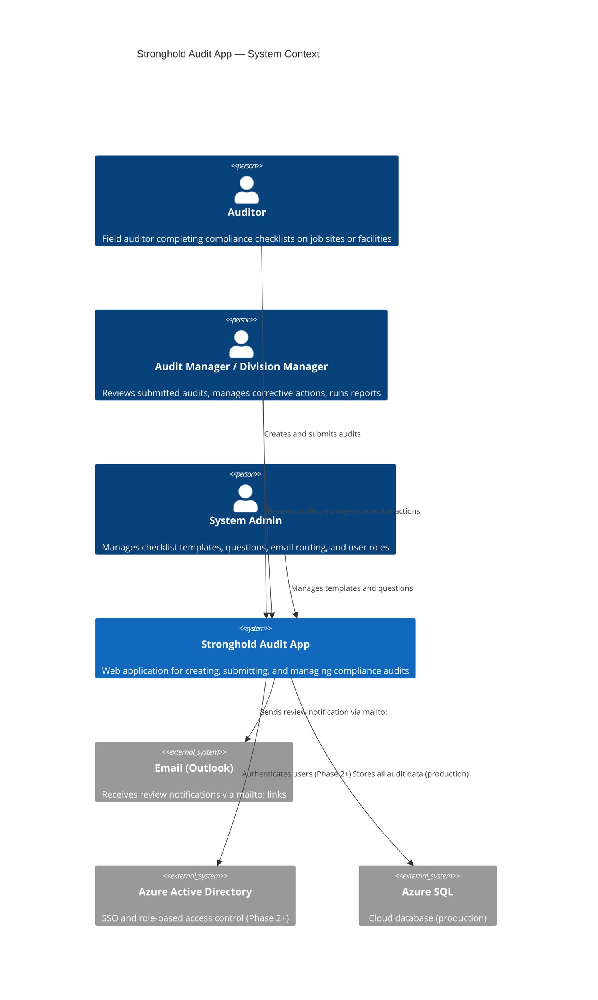
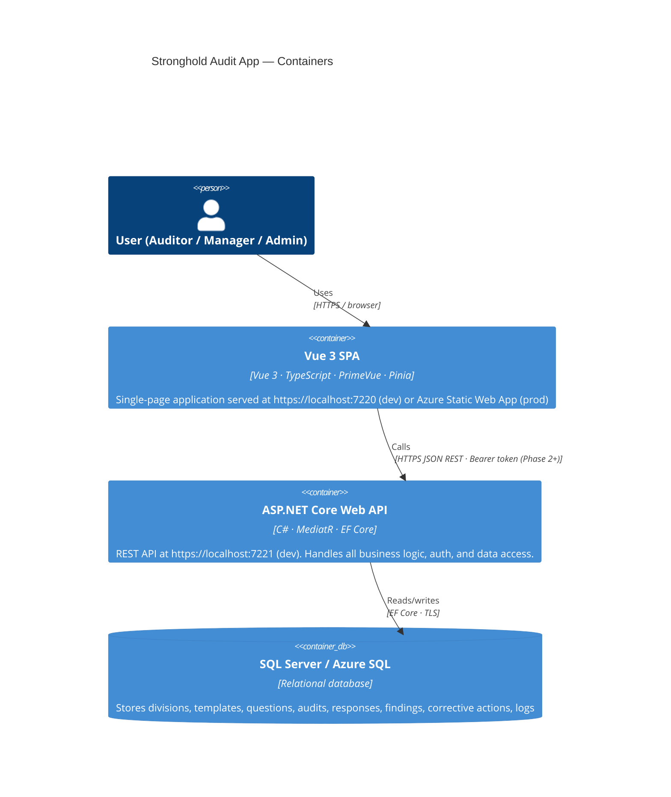
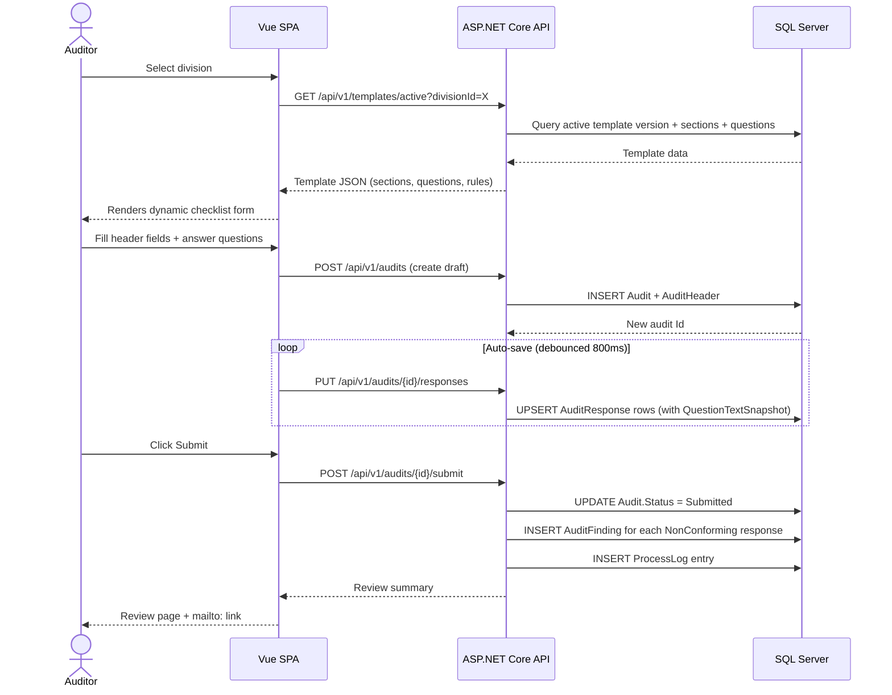
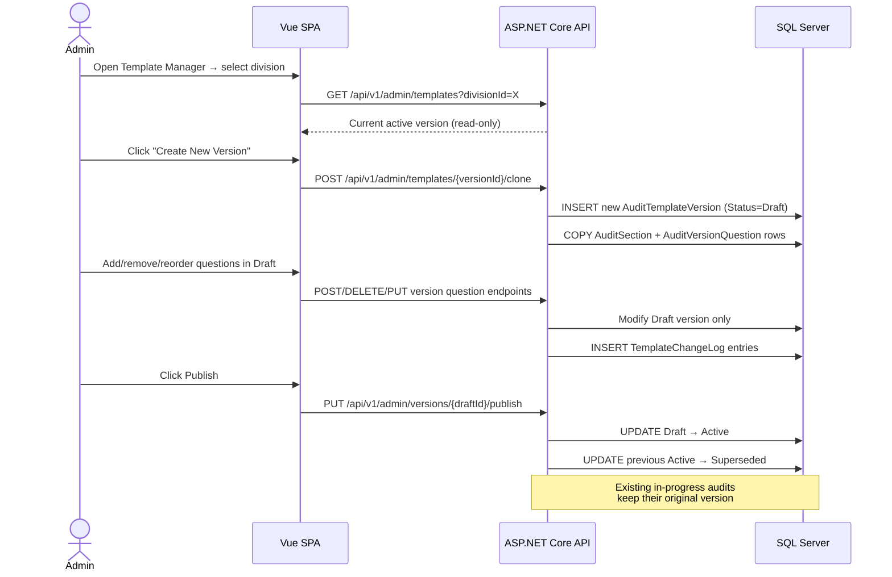

# System Overview

## C4 Context Diagram

```mermaid
C4Context
    title Stronghold Audit App — System Context

    Person(auditor, "Auditor", "Field auditor completing compliance checklists on job sites or facilities")
    Person(manager, "Audit Manager / Division Manager", "Reviews submitted audits, manages corrective actions, runs reports")
    Person(admin, "System Admin", "Manages checklist templates, questions, email routing, and user roles")

    System(app, "Stronghold Audit App", "Web application for creating, submitting, and managing compliance audits")

    System_Ext(email, "Email (Outlook)", "Receives review notifications via mailto: links")
    System_Ext(aad, "Azure Active Directory", "SSO and role-based access control (Phase 2+)")
    System_Ext(azure_sql, "Azure SQL", "Cloud database (production)")

    Rel(auditor, app, "Creates and submits audits")
    Rel(manager, app, "Reviews audits, manages corrective actions")
    Rel(admin, app, "Manages templates and questions")
    Rel(app, email, "Sends review notification via mailto:")
    Rel(app, aad, "Authenticates users (Phase 2+)")
    Rel(app, azure_sql, "Stores all audit data (production)")
```

---

## C4 Container Diagram

```mermaid
C4Container
    title Stronghold Audit App — Containers

    Person(user, "User (Auditor / Manager / Admin)")

    Container(spa, "Vue 3 SPA", "Vue 3 · TypeScript · PrimeVue · Pinia", "Single-page application served at https://localhost:7220 (dev) or Azure Static Web App (prod)")
    Container(api, "ASP.NET Core Web API", "C# · MediatR · EF Core", "REST API at https://localhost:7221 (dev). Handles all business logic, auth, and data access.")
    ContainerDb(db, "SQL Server / Azure SQL", "Relational database", "Stores divisions, templates, questions, audits, responses, findings, corrective actions, logs")

    Rel(user, spa, "Uses", "HTTPS / browser")
    Rel(spa, api, "Calls", "HTTPS JSON REST · Bearer token (Phase 2+)")
    Rel(api, db, "Reads/writes", "EF Core · TLS")
```

---

## Key Flows

### Auditor Creates and Submits an Audit

```mermaid
sequenceDiagram
    actor A as Auditor
    participant SPA as Vue SPA
    participant API as ASP.NET Core API
    participant DB as SQL Server

    A->>SPA: Select division
    SPA->>API: GET /api/v1/templates/active?divisionId=X
    API->>DB: Query active template version + sections + questions
    DB-->>API: Template data
    API-->>SPA: Template JSON (sections, questions, rules)
    SPA-->>A: Renders dynamic checklist form

    A->>SPA: Fill header fields + answer questions
    SPA->>API: POST /api/v1/audits (create draft)
    API->>DB: INSERT Audit + AuditHeader
    DB-->>API: New audit Id

    loop Auto-save (debounced 800ms)
        SPA->>API: PUT /api/v1/audits/{id}/responses
        API->>DB: UPSERT AuditResponse rows (with QuestionTextSnapshot)
    end

    A->>SPA: Click Submit
    SPA->>API: POST /api/v1/audits/{id}/submit
    API->>DB: UPDATE Audit.Status = Submitted
    API->>DB: INSERT AuditFinding for each NonConforming response
    API->>DB: INSERT ProcessLog entry
    API-->>SPA: Review summary
    SPA-->>A: Review page + mailto: link
```

### Admin Updates a Checklist Template

```mermaid
sequenceDiagram
    actor Admin
    participant SPA as Vue SPA
    participant API as ASP.NET Core API
    participant DB as SQL Server

    Admin->>SPA: Open Template Manager → select division
    SPA->>API: GET /api/v1/admin/templates?divisionId=X
    API-->>SPA: Current active version (read-only)

    Admin->>SPA: Click "Create New Version"
    SPA->>API: POST /api/v1/admin/templates/{versionId}/clone
    API->>DB: INSERT new AuditTemplateVersion (Status=Draft)
    API->>DB: COPY AuditSection + AuditVersionQuestion rows

    Admin->>SPA: Add/remove/reorder questions in Draft
    SPA->>API: POST/DELETE/PUT version question endpoints
    API->>DB: Modify Draft version only
    API->>DB: INSERT TemplateChangeLog entries

    Admin->>SPA: Click Publish
    SPA->>API: PUT /api/v1/admin/versions/{draftId}/publish
    API->>DB: UPDATE Draft → Active
    API->>DB: UPDATE previous Active → Superseded
    Note over API,DB: Existing in-progress audits<br/>keep their original version
```
