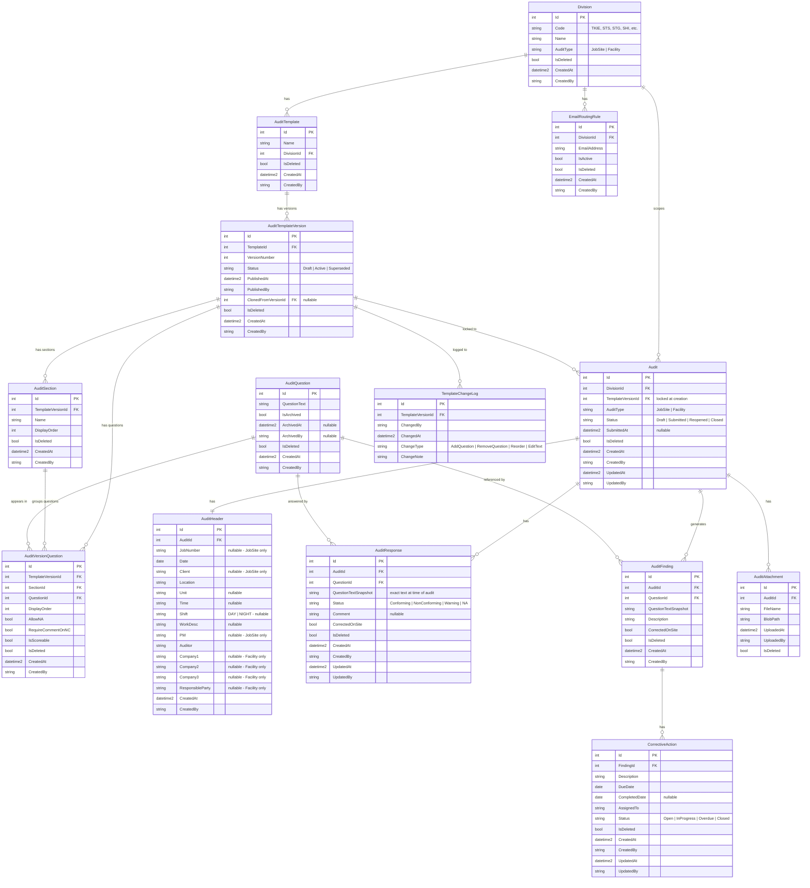

# Database Schema

## Entity Relationship Diagram

---

## Standard Columns on Every Table

Every table in the Audit schema includes these columns — no exceptions:

| Column | Type | Purpose |
|---|---|---|
| `Id` | `int IDENTITY` | Primary key |
| `CreatedAt` | `datetime2 NOT NULL DEFAULT GETUTCDATE()` | When the record was created |
| `CreatedBy` | `nvarchar NOT NULL` | Who created it (Azure AD UPN or dev bypass user) |
| `UpdatedAt` | `datetime2 NULL` | When last modified (null if never updated) |
| `UpdatedBy` | `nvarchar NULL` | Who last modified it |
| `IsDeleted` | `bit NOT NULL DEFAULT 0` | Soft delete flag |
| `DeletedAt` | `datetime2 NULL` | When soft-deleted |
| `DeletedBy` | `nvarchar NULL` | Who soft-deleted it |

`UpdatedAt/By` and `DeletedAt/By` are omitted from lookup/log tables where they are not applicable.

---

## Indexes

| Table | Index | Columns | Reason |
|---|---|---|---|
| `Audit` | `IX_Audit_DivisionId` | DivisionId | Every list query filters by division |
| `Audit` | `IX_Audit_Status` | Status | Constant filter (Draft vs Submitted) |
| `Audit` | `IX_Audit_CreatedBy` | CreatedBy | Auditor-scoped views |
| `AuditResponse` | `IX_AuditResponse_AuditId` | AuditId | Joined on every form load |
| `AuditVersionQuestion` | `IX_AVQ_TemplateVersionId` | TemplateVersionId | Joined on every template load |
| `AuditVersionQuestion` | `IX_AVQ_QuestionId` | QuestionId | Archive lookups |
| `EmailRoutingRule` | `IX_EmailRouting_DivisionId` | DivisionId | Looked up on every submit |
