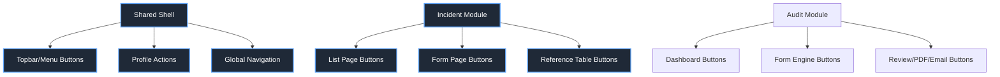

# Coverage Map

```mermaid
flowchart TB
    A[Shared Shell] --> A1[Topbar/Menu Buttons]
    A --> A2[Profile Actions]
    A --> A3[Global Navigation]

    B[Incident Module] --> B1[List Page Buttons]
    B --> B2[Form Page Buttons]
    B --> B3[Reference Table Buttons]

    C[Audit Module] --> C1[Dashboard Buttons]
    C --> C2[Form Engine Buttons]
    C --> C3[Review/PDF/Email Buttons]

    classDef strict fill:#1f2937,color:#fff,stroke:#60a5fa,stroke-width:2px;
    class A,A1,A2,A3,B,B1,B2,B3 strict;
```
