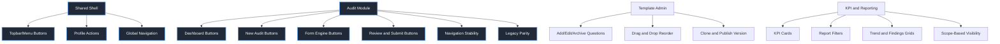

# Coverage Map

```mermaid
flowchart TB
    A[Shared Shell] --> A1[Topbar/Menu Buttons]
    A --> A2[Profile Actions]
    A --> A3[Global Navigation]

    B[Audit Module] --> B1[Dashboard Buttons]
    B --> B2[New Audit Buttons]
    B --> B3[Form Engine Buttons]
    B --> B4[Review and Submit Buttons]
    B --> B5[Navigation Stability]
    B --> B6[Legacy Parity]

    C[Template Admin] --> C1[Add/Edit/Archive Questions]
    C --> C2[Drag and Drop Reorder]
    C --> C3[Clone and Publish Version]

    D[KPI and Reporting] --> D1[KPI Cards]
    D --> D2[Report Filters]
    D --> D3[Trend and Findings Grids]
    D --> D4[Scope-Based Visibility]

    classDef strict fill:#1f2937,color:#fff,stroke:#60a5fa,stroke-width:2px;
    class A,A1,A2,A3,B,B1,B2,B3,B4,B5,B6 strict;
```
