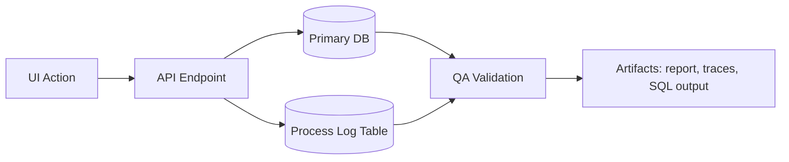

# DB Validation Map

```mermaid
flowchart LR
    UI[UI Action]
    API[API Endpoint]
    DB[(Primary DB)]
    Log[(Process Log Table)]
    QA[QA Validation]

    UI --> API --> DB
    API --> Log
    DB --> QA
    Log --> QA

    QA --> Evidence[Artifacts: report, traces, SQL output]
```
