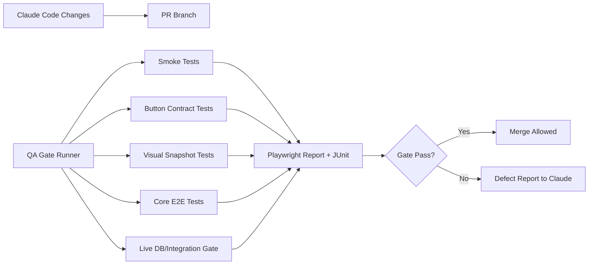

# Test Architecture

```mermaid
flowchart LR
    Dev[Claude Code Changes] --> PR[PR Branch]
    QA[QA Gate Runner] --> Smoke[Smoke Tests]
    QA --> Buttons[Button Contract Tests]
    QA --> Visuals[Visual Snapshot Tests]
    QA --> CoreE2E[Core E2E Tests]
    QA --> Live[Live DB/Integration Gate]
    Smoke --> Report[Playwright Report + JUnit]
    Buttons --> Report
    Visuals --> Report
    CoreE2E --> Report
    Live --> Report
    Report --> Decision{Gate Pass?}
    Decision -- Yes --> Merge[Merge Allowed]
    Decision -- No --> Defect[Defect Report to Claude]
```
