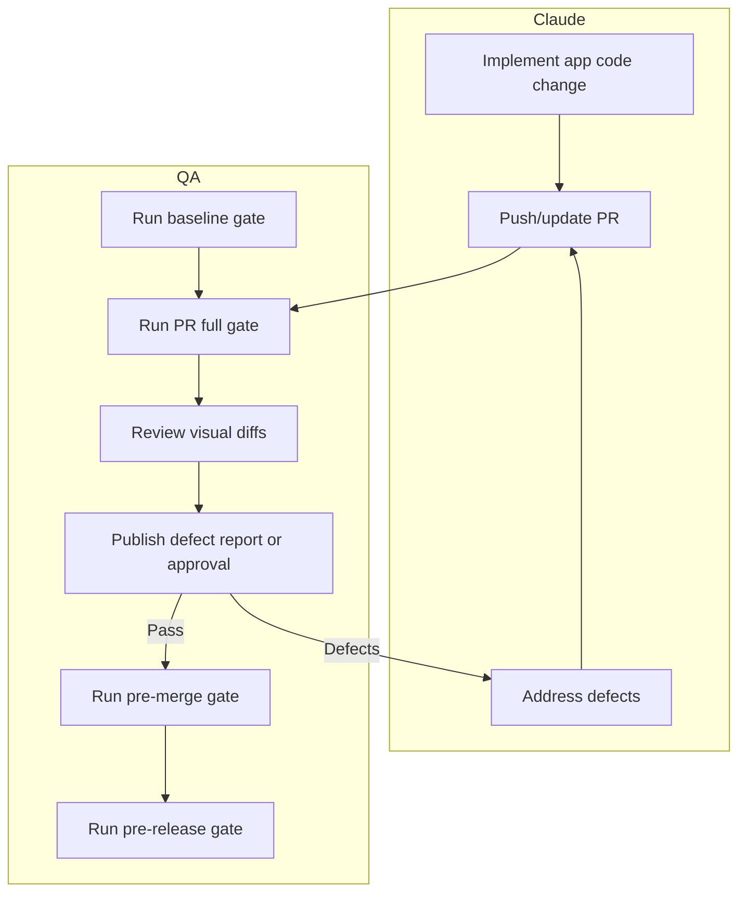

# QA Workflow Swimlane

```mermaid
flowchart TD
    subgraph Claude
        C1[Implement app code change]
        C2[Push/update PR]
        C3[Address defects]
    end

    subgraph QA
        Q1[Run baseline gate]
        Q2[Run PR full gate]
        Q3[Review visual diffs]
        Q4[Publish defect report or approval]
        Q5[Run pre-merge gate]
        Q6[Run pre-release gate]
    end

    C1 --> C2 --> Q2
    Q1 --> Q2
    Q2 --> Q3 --> Q4
    Q4 -->|Defects| C3 --> C2
    Q4 -->|Pass| Q5 --> Q6
```
