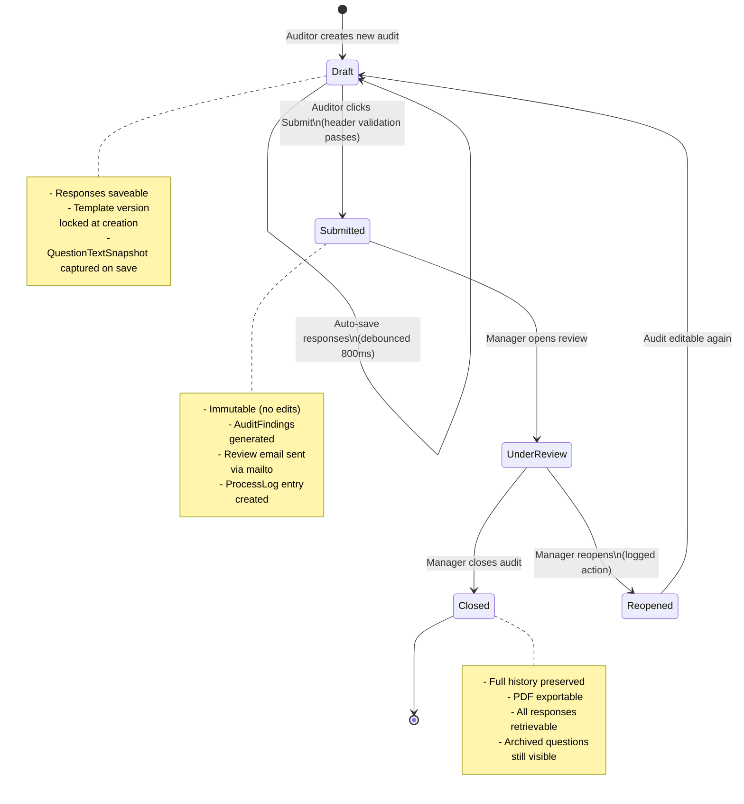
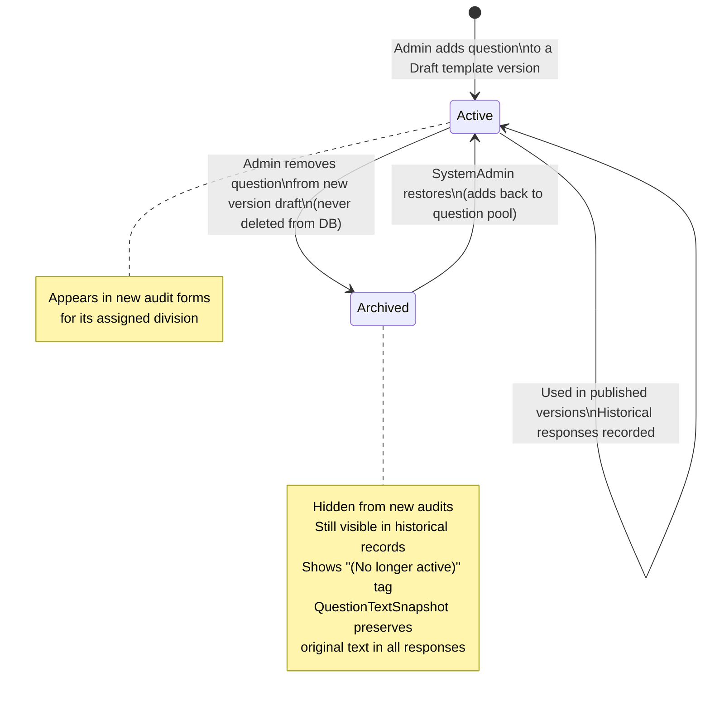
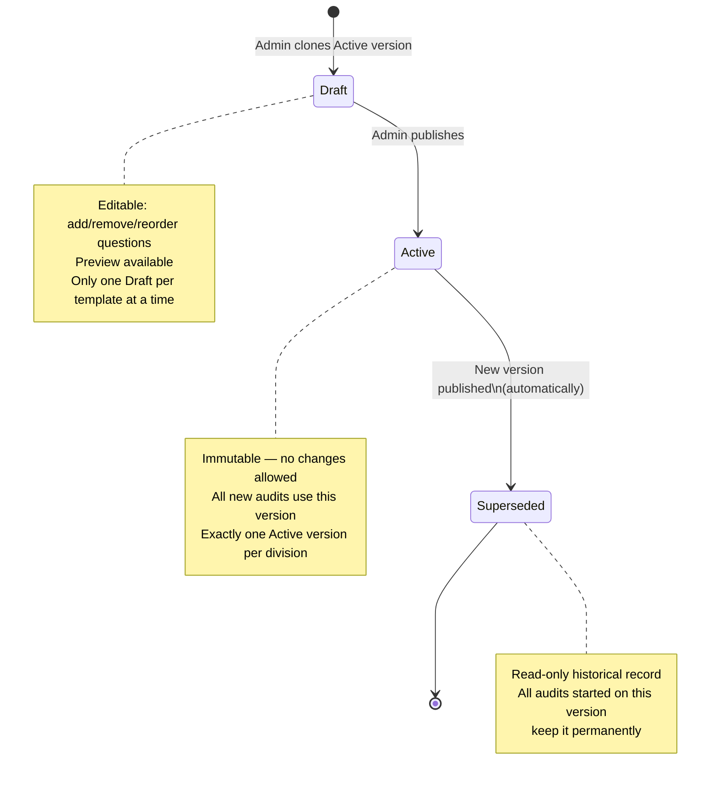
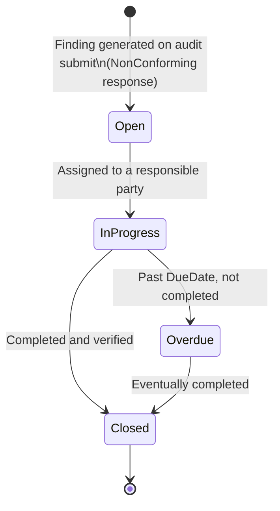

# Audit Lifecycle

## Audit Status State Machine

```mermaid
stateDiagram-v2
    [*] --> Draft : Auditor creates new audit
    Draft --> Draft : Auto-save responses\n(debounced 800ms)
    Draft --> Submitted : Auditor clicks Submit\n(header validation passes)
    Submitted --> UnderReview : Manager opens review
    UnderReview --> Closed : Manager closes audit
    UnderReview --> Reopened : Manager reopens\n(logged action)
    Reopened --> Draft : Audit editable again
    Closed --> [*]

    note right of Draft
        - Responses saveable
        - Template version locked at creation
        - QuestionTextSnapshot captured on save
    end note

    note right of Submitted
        - Immutable (no edits)
        - AuditFindings generated
        - Review email sent via mailto
        - ProcessLog entry created
    end note

    note right of Closed
        - Full history preserved
        - PDF exportable
        - All responses retrievable
        - Archived questions still visible
    end note
```

---

## Question Lifecycle

```mermaid
stateDiagram-v2
    [*] --> Active : Admin adds question\nto a Draft template version
    Active --> Active : Used in published versions\nHistorical responses recorded
    Active --> Archived : Admin removes question\nfrom new version draft\n(never deleted from DB)
    Archived --> Active : SystemAdmin restores\n(adds back to question pool)

    note right of Active
        Appears in new audit forms
        for its assigned division
    end note

    note right of Archived
        Hidden from new audits
        Still visible in historical records
        Shows "(No longer active)" tag
        QuestionTextSnapshot preserves
        original text in all responses
    end note
```

---

## Template Version Lifecycle

```mermaid
stateDiagram-v2
    [*] --> Draft : Admin clones Active version
    Draft --> Active : Admin publishes
    Active --> Superseded : New version published\n(automatically)
    Superseded --> [*]

    note right of Draft
        Editable: add/remove/reorder questions
        Preview available
        Only one Draft per template at a time
    end note

    note right of Active
        Immutable — no changes allowed
        All new audits use this version
        Exactly one Active version per division
    end note

    note right of Superseded
        Read-only historical record
        All audits started on this version
        keep it permanently
    end note
```

---

## Corrective Action Lifecycle

```mermaid
stateDiagram-v2
    [*] --> Open : Finding generated on audit submit\n(NonConforming response)
    Open --> InProgress : Assigned to a responsible party
    InProgress --> Closed : Completed and verified
    InProgress --> Overdue : Past DueDate, not completed
    Overdue --> Closed : Eventually completed
    Closed --> [*]
```
